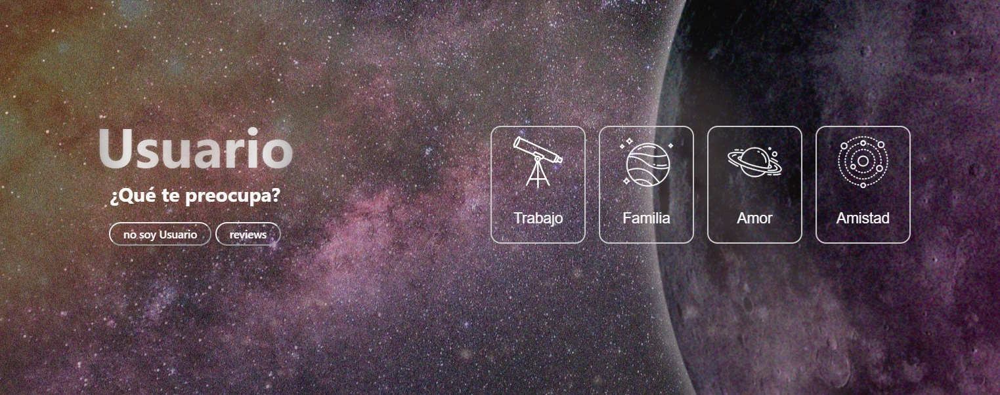

# 🚀 Adviser

**Adviser** is a space-themed application that guides users on a journey from the outermost parts of the universe to their innermost self.

## 🌌 Description

The app offers an interactive experience where the user selects a **category** (e.g. love, work, friends, family). Each category represents a constellation in the emotional universe of the user.

Once a category is selected:
- The app connects to a **specific Firebase collection** that contains questions related to that topic.
- The user answers each question with **yes**, **no**, or **not sure**.
- Based on the answers, the system calculates a score by adding or subtracting points.

At the end of the quiz:
- If the score is high enough, the system pulls a response from the **positive responses collection**.
- If the score is low, it pulls a response from the **negative responses collection**.

In essence, **the app assesses the user's emotional state in a given category** and returns advice accordingly.

## 🌠 Features

- 🌌 Space-themed animated interface
- 🧠 Emotional state evaluation per category
- 🎯 Dynamic scoring system based on user responses
- 🌈 Personalized positive or reflective advice
- 💬 Review and feedback management
- 💾 User name stored locally via **localStorage**

## 🛠 Tech Stack

- **React**
- **Firebase Firestore**
- **Vite**
- **LocalStorage**

---

🛸 **WORK IN PROGRESS** – constant improvements ahead!

---

# 🚀 Adviser

**Adviser** es una aplicación tematizada en el espacio exterior que guía al usuario en un viaje desde lo más lejano del universo hasta su interior emocional.

## 🌌 Descripción

La app propone una experiencia interactiva donde el usuario selecciona una **categoría** (por ejemplo: amor, trabajo, amigos, familia). Cada categoría representa una constelación distinta dentro del universo emocional del usuario.

Al elegir una categoría:
- Se conecta con una **colección específica de Firebase** con preguntas relacionadas a esa temática.
- El usuario responde con **sí**, **no** o **no sé**.
- Según las respuestas, se suman o restan puntos que determinan un puntaje final.

Al finalizar el cuestionario:
- Si el puntaje es alto, se busca una respuesta en la **colección de respuestas positivas**.
- Si el puntaje es bajo, se elige una respuesta desde la **colección de respuestas negativas**.

Simplificadamente, **la app mide el estado anímico o nivel de positivismo del usuario en esa categoría**, y entrega un consejo alineado.

## 🌠 Funcionalidades

- 🌌 Interfaz visual tematizada en el espacio
- 🧠 Evaluación emocional por categoría
- 🎯 Sistema de puntaje dinámico
- 🌈 Consejos personalizados según el resultado
- 💬 Gestión de reseñas
- 💾 Almacenamiento del nombre del usuario en **localStorage**

## 🛠 Tecnologías

- **React**
- **Firebase Firestore**
- **Vite**
- **LocalStorage**

---

🛸 **PROYECTO EN DESARROLLO** – mejoras en camino

